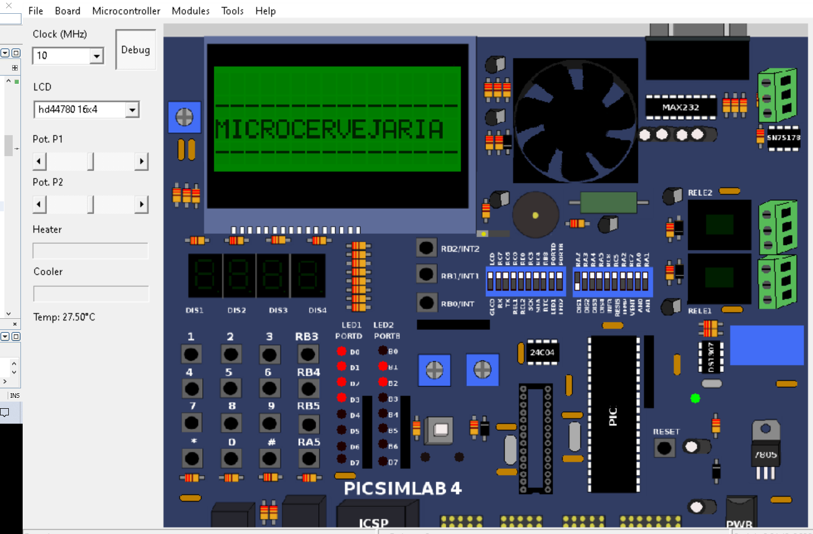

# Microcervejaria-Projeto-de-Programacao-Embarcada-

## Descrição 
Projeto desenvolvido durante o segundo semestre do ano de 2020, nas disciplinas de Programação Embarcada (ECOP04) e Laboratório de Programação Embarcada (ECOP14), da Universidade Federal de Itajubá (UNIFEI)

