# Projeto de Microcervejaria com PIC18F4520 Usando MPLABX e PICSimLab

## Descrição 
O presente projeto consiste no sistema de controle de uma microcervejaria, responsável pela realização automatizada do processo de brassagem na produção de cervejas. Nele, é simulada sua utilização através do software PICSimLab, mais específicamente na placa PICGenios, onde são utilizados os seguintes periféricos :

- Display de 7 Segmentos : Utilizado para informar ao usuário a temperatura atual do líquido;
- Teclado Matricial : Utilizado pelo usuário para navegar na tela incial, escolher a receita que será feita e informar o controlador que certas ações foram finalizadas, como a inserção de lúpulo; 
- Display de LCD 16x4 : Mostrará todas as informações relevantes ao usuário, do início ao fim do processo;
- Cooler : Representará a bomba de água da microcervejaria, esta que será ligada para circular a mistura durante os degraus da prá-fervura; 
- Buzzer : Avisará o usuário quando uma etapa for concluída, além de avisar o fim da receita também;  

## Passo 01 - Adicionar Bibliotecas Necessárias 
Incialmente foram adicionadas todas as bibliotecas necessárias para o funcionamento correto do microcontrolador com os periféricos citados anteriormente, principalmente dentro das funções `amber_lager()` e `k_weissbier()`, responsáveis por todo o processo da brassagem em cada tipo de cerveja. Estas utilizaram as seguintes bibliotecas :

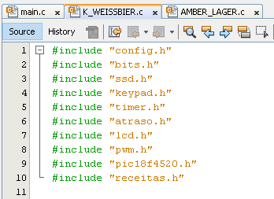

Já no caso da `main()`, o uso das bibliotecas ficou ligeiramente reduzido, isso porque ela apenas é responsável por realizar a interação inicial com o usuário para realizar a chamada das funções das cervejas posteriormente. Esta utilizou as seguintes bibliotecas : 

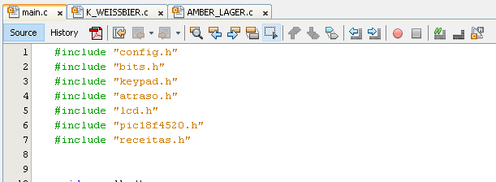

### Alguns Problemas de Compatibilidade
Nesta etapa do desenvolvimento, notou-se que algumas das bibliotecas utilizadas, se colocadas em conjunto com as originais do desenvolvedor do software do PICSimLab, entravam em conflito e o funcionamento da simulação se tornava instável. Assim, todas as bibliotecas originais foram retiradas e todo o projeto foi feito utilizando apenas as fornecidas durante a matéria de ECOP04, desenvolvidas pelo professor Rodrigo Maximiano de Almeida. 

## Passo 02 - Desenvolver as Funções das Receitas e Funções Auxiliares
`Lorem_Ipsum`

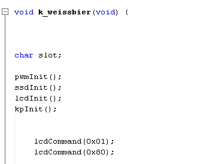

`Lorem_Ipsum`

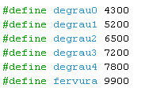

`Lorem_Ipsum`

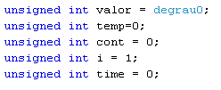

`Lorem_Ipsum`

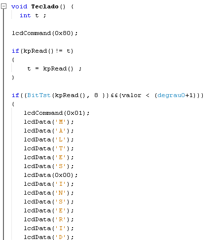

`Lorem_Ipsum`

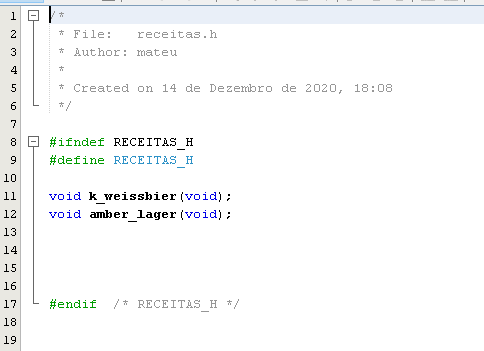

`Lorem_Ipsum`

## Passo 03 - Desenvolver a main()
A `main` foi desenvolvida utilizando como base o próprio funcionamento em cooperative multitasking das funções `amber_lager()` e `k_weissbier()`, no entanto, diferentemente de realizar ações envolvendo o buzzer, o cooler ou o display de 7 segmentos, utiliza apenas o teclado matricial e o display de LCD. A função `escolha()` permite que seja possível verificar a afirmação anterior, sendo ela uma simplificação da função `Teclado()` para apenas alterar telas do display e chamar as funções das receitas escolhidas.

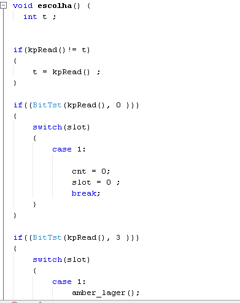

## Passo 04 - Simular pelo PICSimLab
Por fim, é realizada a simulação de todo o funcionamento da microcervejaria, verificando a utilização da `main()` inicialmente e das funções `amber_lager()` ou `k_weissbier()`, dependendo da escolha do usuário. 

Incialmente são exibidas as receitas

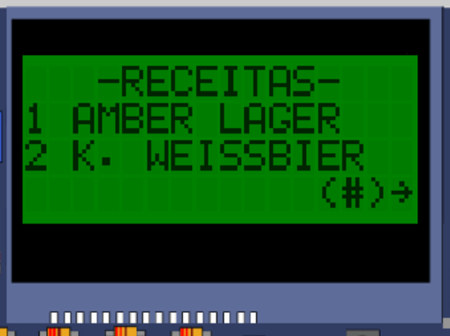

Então é possível navegar entre a tela de receitas e de escolha, nas quais é possível pressionar as teclas `1` (Amber Lager), `2` (Kristall Weissbier), `*`(Voltar) e `#`(Prosseguir)

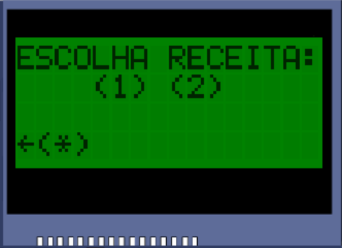

Posteriormente a receita é iniciada, os detalhes desta são exibidos e a temperatura começa a subir até o `degrau0` daquela cerveja, então o controlador aguardará a inserção dos maltes

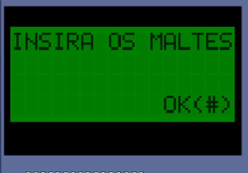

O processo retorna e percorrerá o restante dos degraus, com avisos sonoros em cada etapa e decrescendo o tempo em minutos até chegar à fervura, a qual funcionará exatamente da mesma forma, no entanto ao invés de aguardar a inserção de malte, aguardará a inserção de lúpulo.

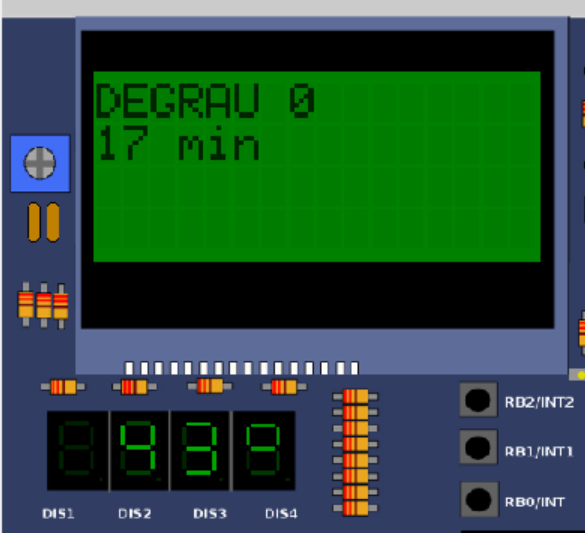

Por fim, um outro aviso sonoro será disparado para avisar ao usuário o final da receita, juntamente com o aviso na tela de LCD, nesta etapa a temperatura retorna às suas condições normais

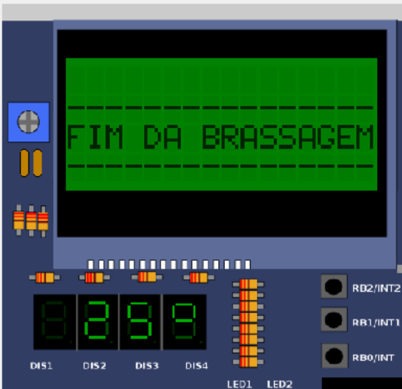

